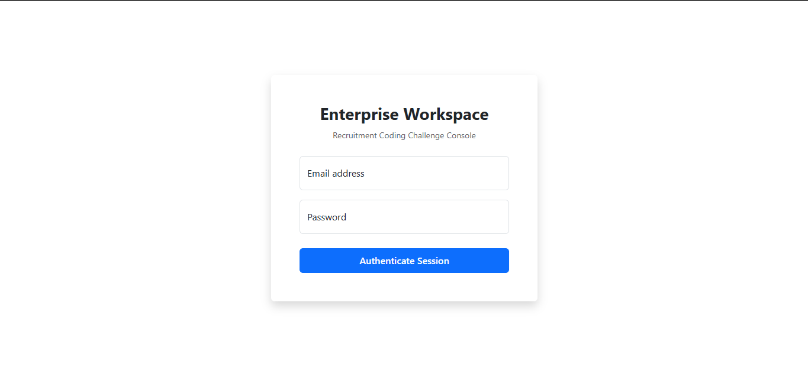
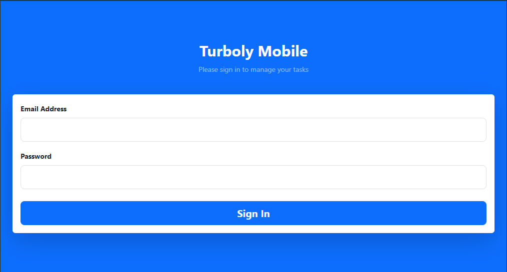
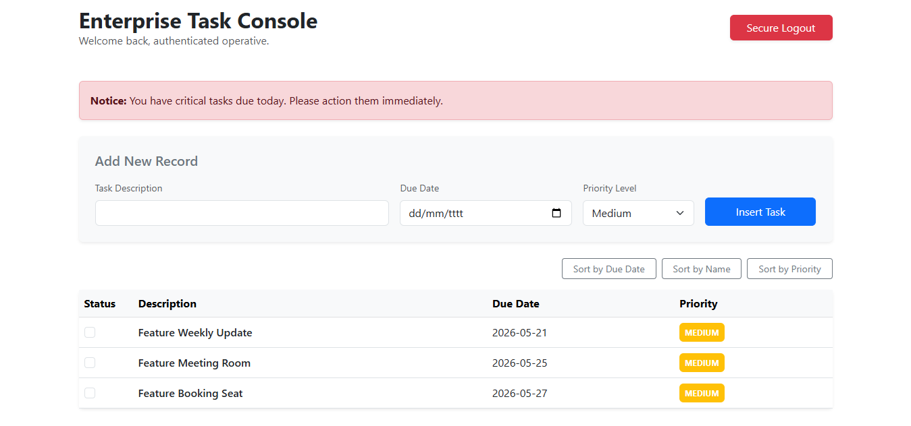

# 🚀 Enterprise Task Management System - Turboly Coding Challenge

A robust, production-ready Task Management Application featuring an adaptive workspace interface. Built on a modern full-stack architecture leveraging **Laravel 11** for the backend API and **React (TypeScript / TSX)** powered by **Vite** for a highly responsive frontend.

---

## 🛠️ Tech Stack & Architecture

- **Backend:** Laravel 11 (PHP 8.2+) with Eloquent ORM
- **Frontend:** React JS, TypeScript (TSX)
- **Build Tool:** Vite (with `@vitejs/plugin-react` integration)
- **Styling UI:** Bootstrap Framework & Custom CSS Variables
- **Database:** MySQL / MariaDB (XAMPP environment compatible)

---

## ✨ Key Features Implemented

1. **Adaptive Authentication System:** Smart and secure multi-device login interfaces, including a specialized **Smartphone Interface** alongside the **Standard Desktop Workspace**.
2. **Core Task Management:** Full-cycle task tracking with distinct properties for Priority Alignment, Alert Due constraints, and Task Lifecycle Management.
3. **TypeScript Integration:** Strict type definition files (`tsconfig.json`) ensuring robust code quality and enterprise-grade maintainability.

---

## 📸 Application Showcases & Screen Captures

Below are the interface captures representing the multi-device support and core dashboards within the application:

### 1. Authentication Gateways (Adaptive Login)

#### 🖥️ Desktop Standard Login
*The unified enterprise portal layout designed for wide screens.*


#### 📱 Smartphone Customized Login
*The clean, centered, dynamic interface automatically optimized for mobile web-views.*


---

### 2. Core Workspace Dashboards

#### 📊 Main Workspace Dashboard
*Central hub containing shortcuts, operational tags (e.g., "New Joiner" badge), and task progress analytics.*


---

## ⚙️ Installation & Local Setup Guide

Follow these steps to run the enterprise workspace on your local environment:

### Prerequisites
- PHP >= 8.2 (with OpenSSL, PDO, and MBString extensions enabled)
- Composer
- Node.js & npm (Latest LTS recommended)
- XAMPP / WampServer (MySQL Server)

### Step 1: Clone and Environment Setup
```bash
# Clone the repository
git clone [https://github.com/rizkiazrial911/turboly-coding-challange.git](https://github.com/rizkiazrial911/turboly-coding-challange.git)
cd turboly-coding-challange

# Copy environment template
cp .env.example .env
```
Note: Open your .env file and configure your local database credentials (DB_DATABASE, DB_USERNAME, DB_PASSWORD).

### Step 2: Backend Installation & Key Generation
```
# Install PHP dependencies
composer install

# Generate application cryptographic key
php artisan key:generate

# Run database migrations and seed baseline records
php artisan migrate --seed
```

### Step 3: Frontend Dependency Initialization
```
# Install NPM packages
npm install

# Compile the assets and start Vite Dev Server
npm run dev
```

### Step 4: Run Application Server
In a separate terminal tab, spin up the local Laravel development server:
```
php artisan serve
```
The workspace will be fully accessible at http://127.0.0.1:8000.

### 🔒 Code Quality & Security Audit Compliance
This project is tailored to strictly adhere to enterprise-level software requirements:

* Production Ready: Environment assets are optimized utilizing Vite bundler compression (npm run build verified).

* Secure: Enforced strict Form Validations, SQL-injection proof Eloquent parameters, protected API endpoints, and scoped Mass Assignment array constraints ($fillable).

* Maintainable: Managed cleanly under strict code modularization principless, separating UI layouts from state orchestration layers. Fully compatible with TypeScript type-emission standard verification checks (npx -p typescript tsc --noEmit).